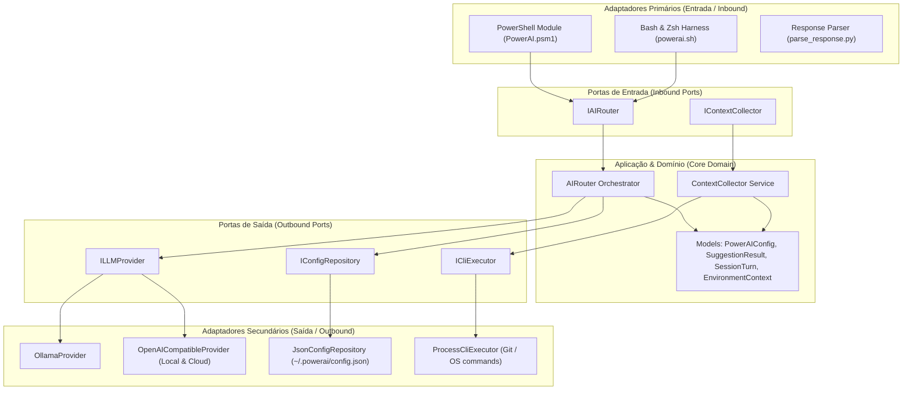

<div align="center">

# ✦ PowerAI
### A Camada Cognitiva Invisível & Copiloto para o seu Terminal
*The Invisible Cognitive Layer & AI Copilot for macOS, Linux, and Windows*

[](LICENSE)
[](https://github.com/Luizhcrs/nuno)
[](https://ollama.com)
[-purple?style=flat-square)](https://github.com/Luizhcrs/nuno)
[](https://github.com/Luizhcrs/nuno)

<br/>

[**🌐 Acesse a Landing Page & Demo Interativo**](https://luizhcrs.github.io/nuno) • [**⚡ Instalação Rápida**](#-instalação-rápida) • [**🧠 Recursos**](#-superpoderes) • [**🏗️ Arquitetura**](#-arquitetura-hexagonal) • [**⚙️ Configuração**](#-configurações)

---

</div>

<br/>

```text
  ✦  P O W E R A I
     Camada Cognitiva & Copiloto para Terminal
     ─────────────────────────────────────────────────────────────

  ✓  1. Idioma do Sistema:       Português (Brasil) (Auto-detectado)
  ✓  2. Ambiente & Ferramentas:  curl, python3, jq prontos
  ✓  3. Provedor de IA:          Ollama Local (http://localhost:11434)
  ✓  4. Modelo Selecionado:      qwen2.5-coder:1.5b (Apple Metal GPU)
  ✓  5. Recursos de Terminal:    Sugestões e correções automáticas ativadas

  ✦ PowerAI instalado com sucesso!
```

<br/>

## ⚡ Instalação Rápida

Em qualquer terminal limpo, execute uma única linha:

### 🍎 macOS & 🐧 Linux (Bash & Zsh)
```bash
curl -fsSL https://raw.githubusercontent.com/Luizhcrs/nuno/main/install.sh | bash
```

### 🪟 Windows (PowerShell 5.1 / 7+ & CMD)
```powershell
irm https://raw.githubusercontent.com/Luizhcrs/nuno/main/install.ps1 | iex
```

> **Nota de Instalação Autônoma**: O instalador é *Self-Healing* — se a sua máquina não tiver `curl`, `python3` ou `jq`, ele instala tudo automaticamente. Se você escolher Ollama, ele também pode instalar e baixar o modelo leve em 1 clique.

---

## 🧠 Superpoderes

### 1. ⚡ Local-First & Privacidade Absoluta
- Funciona 100% offline via **Ollama** (`http://localhost:11434`) ou APIs Locais compatíveis com OpenAI (**OMLX**, **LM Studio**, **vLLM** em `:5151` / `:8000`).
- Aceleração por hardware nativa (**Apple Metal GPU** no macOS / **CUDA** no Linux & Windows) para respostas em **menos de 800ms**.

### 2. 🔍 Memória de Saída Contextual de Comandos
- O PowerAI mantém um buffer inteligente das últimas saídas exibidas no seu terminal (*stdout/stderr*).
- Permite fazer perguntas sobre dados já exibidos na tela:
  ```text
  $ ifconfig
  ... (saída de rede com várias interfaces) ...

  $ ai qual é o meu IP local aí na saída?
  ✦ 192.168.0.105 (na interface en0)
  ```

### 3. 🛡️ Zero Risco & Execução Segura
- O PowerAI é **100% Read-Only** por padrão. Nenhum comando é executado silenciosamente.
- Cada ação exige sua confirmação física no teclado: `[Enter/S = Sim | Esc/N = Não]`.

### 4. 🌍 Suporte Multilíngue Nativo (i18n)
- Identifica automaticamente o idioma do sistema operacional (**Português**, **Inglês** e **Espanhol**).
- Permite alternar o idioma do copiloto a qualquer momento:
  ```bash
  ai language en   # Switch to English
  ai language es   # Cambiar a Español
  ai language pt   # Volta para Português
  ```

### 5. 🩹 Interceptação Automática de Erros (*Auto-Healing*)
- Se você digitar um comando incorreto ou que não existe (ex: `dockr ps`), o hook nativo do shell intercepta a falha e sugere a sintaxe correta imediatamente.

---

## 💻 Como Usar

| Comando | Descrição |
| :--- | :--- |
| `ai <pergunta>` | Consulta em linguagem natural no terminal |
| `? <pergunta>` | Atalho rápido para consultas diretas |
| `ai language <pt\|en\|es>` | Troca o idioma do copiloto em tempo real |
| `ai config` | Exibe as configurações ativas e endpoints |
| `ai uninstall` | Desinstalação completa e limpa do PowerAI |

### Exemplos do Dia a Dia:
```bash
# Consultas de infraestrutura e rede
? como listar portas abertas escutando conexões
? como matar todos os processos de node travados

# Análise de arquivos e diretórios
? como encontrar todos os arquivos .log com mais de 100mb
? compactar a pasta src em tar.gz excluindo node_modules

# Git e versionamento
? desfazer o ultimo commit mantendo as alteracoes locais
? listar branches remotas que ja foram mescladas
```

---

## 🏗️ Arquitetura Hexagonal

O núcleo do projeto segue rigorosamente o padrão **Ports & Adapters (Hexagonal Architecture)** em C# (.NET Core), garantindo separação absoluta entre o Domínio e os Provedores de IA:



---

## ⚙️ Configurações (`config.json`)

O arquivo de configuração reside em `~/.powerai/config.json`:

```json
{
  "Mode": "Auto",
  "LocalType": "Ollama",
  "LocalEndpoint": "http://127.0.0.1:5151/v1",
  "LocalApiKey": "",
  "LocalModel": "qwen2.5-coder:1.5b",
  "OllamaEndpoint": "http://localhost:11434",
  "CloudEndpoint": "https://api.openai.com/v1",
  "CloudApiKey": "",
  "CloudModel": "gpt-4o-mini",
  "Language": "pt-BR",
  "AutoSuggestOnErrors": true,
  "AutoHealingRetries": 2,
  "TimeoutSeconds": 25
}
```

---

## 🧪 Testes Automatizados

O repositório inclui suítes completas de testes automatizados:
- **Testes Unitários de Domínio e Arquitetura (.NET / xUnit)**: `tests/PowerAI.Tests/`
- **Testes de Integração e Shell Harness**: `tests/test_harness.sh`

Para rodar os testes localmente:
```bash
./tests/test_harness.sh
```

---

## 📄 Licença

Distribuído sob a licença [MIT](LICENSE). Desenvolvido com foco em alta performance, privacidade local e usabilidade elegante.
