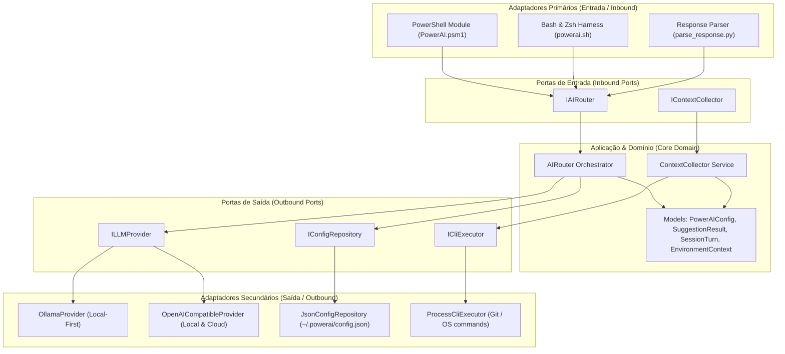

<div align="center">

# ✦ PowerAI
### A Camada Cognitiva Invisível & Copiloto para o seu Terminal
*The Invisible Cognitive Layer & Local-First AI Copilot for macOS, Linux, and Windows*

<br/>

[](https://github.com/Luizhcrs/nuno/releases)
[](LICENSE)
[](#instalação-rápida)
[-emerald?style=flat-square)](https://ollama.com)
[-purple?style=flat-square)](#arquitetura-hexagonal)

<br/>

[**🌐 Experimente a Landing Page & Simulador Web**](https://luizhcrs.github.io/nuno) • [**Instalação Rápida**](#-instalação-rápida) • [**Recursos**](#-recursos-principais) • [**Comandos**](#-guia-de-comandos) • [**Arquitetura**](#-arquitetura-hexagonal) • [**Licença**](#-licença--propriedade-intelectual)

---

</div>

<br/>

```text
  ✦  P O W E R A I
     Camada Cognitiva & Copiloto para Terminal
  ──────────────────────────────────────────────────────────

  ✓  1. Idioma do Sistema:       Português (Brasil) (Auto-detectado)
  ✓  2. Ambiente & Dependências:  curl, python3, jq prontos
  3. Provedor de IA: (Navegue com ↑/↓ e Enter)
    ▸ 1) Ollama Local     · Recomendado: ultrarrápido, offline, <1s
      2) API Local        · OMLX, LM Studio, vLLM em :5151 / :8000
      3) Nuvem            · OpenAI gpt-4o-mini / Groq / OpenRouter
      4) Automático       · Detecta localmente e faz fallback nuvem
```

<br/>

## 🚀 Instalação Rápida

Em qualquer terminal limpo, execute uma única linha para iniciar o assistente interativo:

### macOS & Linux (Bash / Zsh)
```bash
curl -fsSL https://raw.githubusercontent.com/Luizhcrs/nuno/main/install.sh | bash
```

### Windows (PowerShell 5.1 / 7+ & CMD)
```powershell
irm https://raw.githubusercontent.com/Luizhcrs/nuno/main/install.ps1 | iex
```

> **✦ Instalador Auto-Curativo (*Self-Healing*)**: Caso seu sistema não possua `curl`, `python3` ou `jq`, o script resolve e instala as dependências automaticamente via Homebrew, APT, DNF, Pacman ou WinGet. Para uso com Ollama, o modelo de alta performance (`qwen2.5-coder:1.5b`) é configurado automaticamente.

---

## ⚡ Recursos Principais

### 1. 🔒 Local-First & Privacidade Absoluta
- Execução 100% offline via **Ollama** (`http://localhost:11434`) ou APIs Locais (**OMLX**, **LM Studio**, **vLLM** em `:5151` / `:8000`).
- Aceleração por hardware nativa (**Apple Metal GPU** no macOS / **CUDA / DirectML** no Linux & Windows) com inferência instantânea (< 800ms).
- Zero telemetria — seus comandos, histórico e dados nunca saem da sua máquina.

### 2. 🧠 Memória de Saída Contextual (*Output Buffer*)
- Mantém um buffer inteligente da última saída gerada no terminal (*stdout/stderr*).
- Permite fazer perguntas diretas sobre dados impressos na tela sem precisar copiar e colar:
  ```text
  $ ifconfig
  ... (dezenas de linhas de interfaces de rede) ...

  $ ai qual é o meu IP local aí na saída?
  ✦ 192.168.1.100 (na interface en0)
  ```

### 3. 🛡️ Zero Risco por Padrão (*Human-in-the-Loop*)
- Operação **Read-Only** segura. Nenhum comando é executado sem sua confirmação explícita no teclado:
  ```text
  ✦ docker compose up -d --build
  ↳ Sobe os contêineres em segundo plano reconstruindo imagens.

  Executar comando? [Enter/S = Sim | Esc/N = Não]
  ```

### 4. 🌐 Suporte Multilíngue Nativo (i18n)
- Auto-detecção do idioma do sistema operacional (**Português**, **Inglês** e **Espanhol**).
- Troque o idioma a qualquer momento diretamente pelo terminal:
  ```bash
  ai language en   # Switch to English
  ai language es   # Cambiar a Español
  ai language pt   # Retorna para Português
  ```

### 5. 🩹 Auto-Healing de Erros de Sintaxe
- Comandos digitados incorretamente ou inexistentes são interceptados em tempo real pelo hook nativo do shell, sugerindo a sintaxe correta imediatamente.

---

## ⌨️ Guia de Comandos

| Comando | Descrição |
| :--- | :--- |
| `ai <pergunta>` | Consulta em linguagem natural no terminal |
| `? <pergunta>` | Atalho rápido para consultas diretas |
| `ai language <pt\|en\|es>` | Troca o idioma do copiloto em tempo real |
| `ai config` | Exibe as configurações ativas, provedor e endpoints |
| `ai uninstall` | Desinstalação completa e limpeza de perfis |

### Exemplos Práticos do Dia a Dia:

```bash
# Infraestrutura e Redes
? como listar portas abertas escutando conexões TCP
? como matar todos os processos de node travados
? verificar consumo de memória de todos os contêineres docker

# Manipulação de Arquivos e Logs
? como encontrar todos os arquivos .log com mais de 100mb
? compactar a pasta src em tar.gz excluindo node_modules
? buscar a palavra "ERROR" nos últimos 500 logs em tempo real

# Git e Fluxo de Trabalho
? desfazer o ultimo commit mantendo as alteracoes nos arquivos
? listar branches remotas que ja foram mescladas na main
? limpar branches locais que foram deletadas na origem
```

---

## 📐 Arquitetura Hexagonal

O núcleo do projeto segue o padrão **Ports & Adapters (Hexagonal Architecture)** em C# (.NET Core), desacoplando totalmente as regras de negócio dos provedores de IA e terminais:



---

## ⚙️ Configuração Personalizada

O arquivo de configuração reside em `~/.powerai/config.json`:

```json
{
  "Mode": "Auto",
  "LocalType": "Ollama",
  "LocalEndpoint": "http://127.0.0.1:5151/v1",
  "LocalApiKey": "",
  "LocalModel": "qwen2.5-coder:1.5b",
  "OllamaEndpoint": "http://localhost:11434",
  "CloudEndpoint": "https://api.openai.com/v1",
  "CloudApiKey": "",
  "CloudModel": "gpt-4o-mini",
  "Language": "pt-BR",
  "AutoSuggestOnErrors": true,
  "AutoHealingRetries": 2,
  "TimeoutSeconds": 25
}
```

---

## 🧪 Suíte de Testes Automatizados

O projeto possui cobertura de testes de ponta a ponta:
- **Testes Unitários de Domínio (.NET / xUnit)**: `tests/PowerAI.Tests/`
- **Testes de Integração de Terminal**: `tests/test_harness.sh`

Para rodar os testes localmente:
```bash
./tests/test_harness.sh
```

---

## 📄 Licença & Propriedade Intelectual

Este projeto é de código aberto sob os termos da licença **PolyForm Noncommercial License 1.0.0**.

### ✦ O que é PERMITIDO (Gratuito):
- ✅ Uso pessoal ilimitado em suas máquinas e terminais.
- ✅ Uso acadêmico, educacional e pesquisa científica.
- ✅ Estudo do código-fonte, contribuições e desenvolvimento comunitário.
- ✅ Forks não-comerciais mantendo a atribuição original.

### ✦ O que NÃO É PERMITIDO (Sem autorização expressa):
- ❌ Venda direta, revenda ou licenciamento pago do software ou de forks derivados.
- ❌ Distribuição como parte de produtos comerciais pagos, pacotes ou serviços SaaS/Cloud sem autorização prévia.
- ❌ Monetização direta do código ou marca sem acordo comercial formal.

Para fins de licenciamento comercial, parcerias ou integração em produtos comerciais proprietários, entre em contato diretamente com o autor:
- **Autor / Criador**: Luiz Henrique ([@Luizhcrs](https://github.com/Luizhcrs))
- **Repositório**: [github.com/Luizhcrs/nuno](https://github.com/Luizhcrs/nuno)

---

<div align="center">
  <sub>Desenvolvido com 🤍 por <a href="https://github.com/Luizhcrs">Luiz Henrique</a>. Código aberto para toda a comunidade de desenvolvedores.</sub>
</div>
