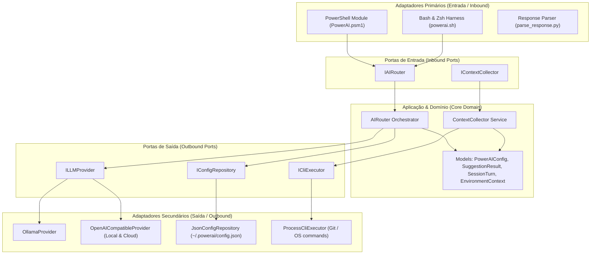

# PowerAI - Camada Cognitiva Invisível para Terminais

O **PowerAI** é um harness cognitivo inteligente e invisível para terminais (**Windows PowerShell & CMD**, **Linux/macOS Bash & Zsh**):
- **Local-First & Multi-Provedor**: Suporte nativo a **Ollama** (`http://localhost:11434`), **APIs Locais Compatíveis com OpenAI** (OMLX, LM Studio, vLLM, LocalAI em `http://127.0.0.1:5151/v1`) e **Nuvem** (OpenAI `gpt-4o-mini`, Groq, Azure).
- **Intervenção Automática em Erros**: Se um comando falhar ou não for encontrado, a IA analisa a mensagem de erro, o histórico do terminal e o diretório de trabalho, sugerindo a correção com `[Enter]` para executar.
- **Design Monocromático Minimalista**: Spinner de pensamento contínuo em Braille e tons suaves de cinza (*estilo Apple / Vercel / Linear*).
- **Memória de Saída de Comandos**: Registra a saída real dos comandos (stdout/stderr) permitindo perguntas contextuais sobre dados já exibidos na tela.
- **Arquitetura Hexagonal**: Separação estrita entre Domínio, Portas e Adaptadores no núcleo .NET (`PowerAI.Core`).

---

## Arquitetura Hexagonal (Ports & Adapters)



---

## Estrutura do Projeto

```text
nuno/
├── src/
│   ├── PowerAI.Core/                 # Núcleo C# (.NET Standard 2.0 / .NET 8)
│   │   ├── Domain/                   # Modelos e Enums do Domínio Puro
│   │   │   ├── Enums/                # ProviderMode, LocalProviderType
│   │   │   └── Models/               # PowerAIConfig, SuggestionResult, SessionTurn, EnvironmentContext
│   │   ├── Ports/                    # Contratos de Portas Inbound & Outbound
│   │   │   ├── Inbound/              # IAIRouter, IContextCollector
│   │   │   └── Outbound/             # ILLMProvider, IConfigRepository, ICliExecutor
│   │   ├── Adapters/                 # Implementação dos Adaptadores
│   │   │   └── Outbound/             # OllamaProvider, OpenAICompatibleProvider, JsonConfigRepository, ProcessCliExecutor
│   │   └── Application/              # Serviços de Aplicação e Orquestração
│   │       ├── AIRouter.cs
│   │       └── ContextCollector.cs
│   └── PowerAI/                      # Módulo PowerShell para Windows (PowerShell 5.1 & 7+)
│       ├── PowerAI.psd1
│       └── PowerAI.psm1
├── powerai.sh                        # Harness nativo Linux & macOS (Bash & Zsh)
├── parse_response.py                 # Extrator e parser resiliente multi-formato
├── install.sh / uninstall.sh         # Instalador e desinstalador para Linux e macOS
├── install.ps1 / uninstall.ps1       # Instalador e desinstalador para Windows
├── Install-PowerAI.ps1 / .cmd        # Scripts locais de conveniência
├── Uninstall-PowerAI.ps1 / .cmd      # Scripts locais de remoção
└── tests/                            # Testes de Unidade C# (xUnit) e PowerShell (Pester)
```

---

## Instalação Rápida Multiplataforma

### No Windows (PowerShell & CMD)
Abra o **PowerShell** e execute:
```powershell
irm https://raw.githubusercontent.com/Luizhcrs/nuno/main/install.ps1 | iex
```

### No Linux e macOS (Bash & Zsh)
Abra o **Terminal** e execute:
```bash
curl -fsSL https://raw.githubusercontent.com/Luizhcrs/nuno/main/install.sh | bash
```

---

## Como Usar

### 1. Consultas em Linguagem Natural
```bash
ai como listar arquivos detalhados
# ou pelo alias rápido:
? qual processo está ouvindo na porta 3000?
```

### 2. Análise Contextual da Saída Anterior
Após executar um comando de diagnóstico (ex: `ifconfig` ou `docker ps`), você pode perguntar sobre o resultado:
```bash
ai qual é o meu ip local ali na saída?
```
👉 *O PowerAI lê a saída do buffer do terminal e entrega a resposta direta.*

### 3. Interceptação Automática de Erros / Digitação
```bash
dockr ps
```
👉 *O terminal exibe o erro e sugere imediatamente `docker ps` para execução.*

---

## Configuração (`~/.powerai/config.json`)

```json
{
  "Mode": "Auto",
  "LocalType": "Ollama",
  "LocalEndpoint": "http://127.0.0.1:5151/v1",
  "LocalApiKey": "",
  "LocalModel": "qwen2.5-coder:1.5b",
  "OllamaEndpoint": "http://localhost:11434",
  "CloudEndpoint": "https://api.openai.com/v1",
  "CloudApiKey": "",
  "CloudModel": "gpt-4o-mini",
  "AutoSuggestOnErrors": true,
  "AutoHealingRetries": 2,
  "TimeoutSeconds": 25
}
```

- Para ver as configurações ativas no terminal:
  ```bash
  ai config
  ```

---

## Desinstalação

### No Windows:
```powershell
ai uninstall
# ou
Uninstall-PowerAI
```

### No Linux / macOS:
```bash
ai uninstall
# ou
curl -fsSL https://raw.githubusercontent.com/Luizhcrs/nuno/main/uninstall.sh | bash
```
